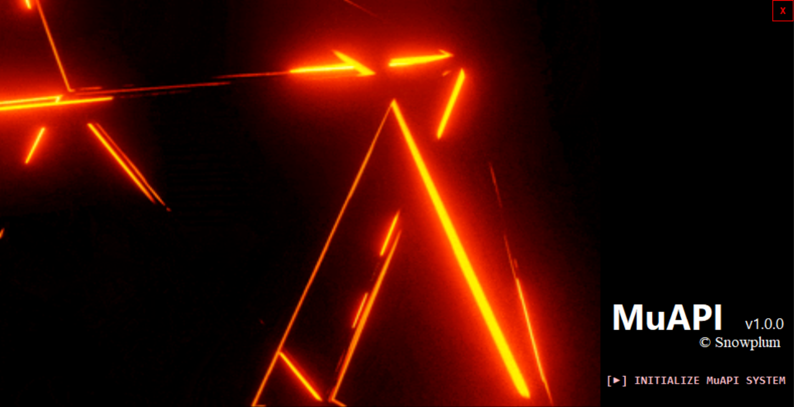

  

# Hi there, I'm MinstrelDev 👋

### 💻 Junior C# Developer 
Specializing in **Advanced Factory Automation** and System Architecture.

- **Main Project**: **MuAPI** (Unified Automation Solution)
- **Key Expertise**: C# WinForms, System Integration, Real-time Data Processing.

### 🛠 Tech Stack
 

### 🔭 Project: MuAPI (Current Development)
- **MuAPI Core**: High-performance automation interface engine.
- **MuAPI_Release**: Stable distribution for production environments.
- **MuAPI_Updater & Installer**: Seamless deployment and version management system.
